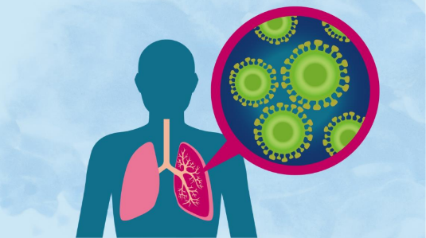

# Pneumonia Detection with Artificial Intelligence - README



## Abstract

Pneumonia Detection with Artificial Intelligence is a project that employs complex neural network models to accurately detect signs of pneumonia in chest X-ray images. The application of this technology can aid doctors in real-world scenarios to diagnose and treat pneumonia effectively. The project utilizes the Chest X-Ray Imaging dataset available on Kaggle and implements convolutional neural networks (CNNs) consisting of five layers. Through the use of a confusion matrix, the model achieves an accuracy of up to 91% in detecting pneumonia in chest X-ray images.

## Python Code

The Python code for the project is available in the `pneumonia_full.ipynb` file. The code performs various tasks, including data loading, data preprocessing, data augmentation, model creation, model training, and analysis after model training. The code is implemented using popular libraries such as Keras, OpenCV, NumPy, Pandas, Matplotlib, Seaborn, and Scikit-learn.

## Installation

To run the Pneumonia Detection with Artificial Intelligence project, follow these steps:

1. Clone the repository from GitHub to your local machine:

```bash
git clone https://github.com/ismetkoseoglu/Pneumonia-Detection-with-AI.git
```

2. Open the `pneumonia_full.ipynb` file in a Jupyter Notebook or Google Colab to access and run the Python code.

3. Ensure you have the necessary libraries installed. You can install them using `pip`:

```bash
pip install keras numpy pandas matplotlib seaborn scikit-learn opencv-python
```

4. Run the code to train the model and evaluate its performance.

## Usage

1. The project's main goal is to detect pneumonia in chest X-ray images.

2. The dataset used for training, validation, and testing contains images of both pneumonia-infected and normal lungs.

3. The code employs data augmentation techniques to increase the number of training examples.

4. The CNN model is designed with multiple layers, including convolutional, pooling, dropout, batch normalization, and dense layers.

5. The model's performance is analyzed using various metrics, including accuracy and loss, both for training and validation datasets.

6. The final model is evaluated on the test dataset and used to make predictions.

## Model Performance

The model's performance is assessed through various metrics, including accuracy, loss, precision, recall, and F1-score. The confusion matrix is used to visualize the model's true positive, true negative, false positive, and false negative predictions.

## Results

The Pneumonia Detection with Artificial Intelligence model achieves an accuracy of up to 91% in detecting pneumonia in chest X-ray images. The project demonstrates the potential of artificial intelligence and deep learning techniques in medical image analysis and disease detection.

## License

This project is licensed under the [MIT License](path/to/LICENSE).

---

Please make sure to replace `app-logo.png` with the path to your project's logo or relevant image. You can also customize the content, add additional sections, and provide any relevant links to the code repository or other resources. This README provides a basic outline of the project, its goals, and how to run and use it. Happy coding!
